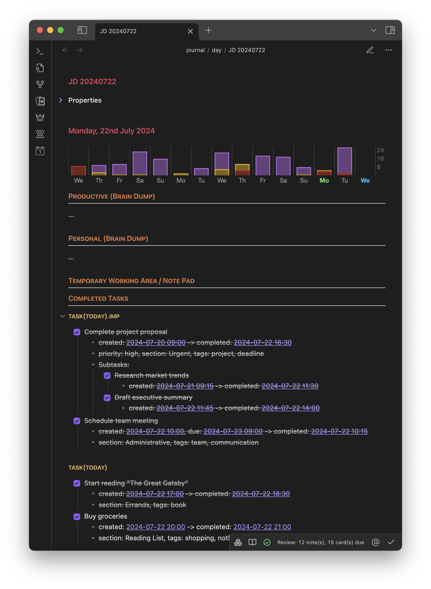
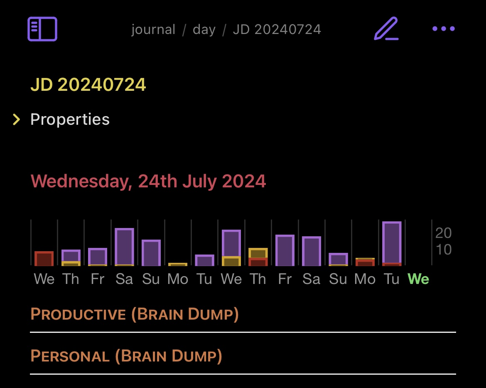

# iOS Reminders to Markdown Journal

## Overview

This program exports completed iOS Reminders tasks to Markdown files, designed to integrate seamlessly with Obsidian, a popular note-taking application. The exported tasks are formatted and organized in Markdown, making it easy to maintain a journal or log of completed tasks. The program offers extensive customization options, allowing users to tailor the output to their specific needs.

## Features

- **Export Completed Reminders**: Automatically export completed iOS Reminders tasks to Markdown files.
- **Obsidian Integration**: Seamlessly integrates with the Obsidian note-taking app, with optional support for the Periodic Notes plugin.
- **Highly Customizable Output**: Configure the output format, including date and time formats, headers, templates, and more.
- **Task Metadata**: Extract and include task tags, URLs, priorities, and sections from the Reminders database.
- **Parent-Child Task Relationships**: Maintain the hierarchy of tasks, including subtasks and parent tasks.
- **Flexible List Filtering**: Import specific lists or exclude certain lists based on configurable patterns.
- **Cache Mechanism**: Avoid reprocessing tasks that have already been exported.
- **Skip Already Imported Notes**: Optionally skip days that have already been imported to avoid duplicates.
- **CSV and JSON Export**: Optional export of reminders to CSV and JSON formats for additional data analysis or backup purposes.
- **Customizable Checkbox Statuses**: Define custom checkbox statuses for cancelled or partially completed tasks.
- **Section-based Task Grouping**: Group tasks by their sections within reminder lists.
- **Advanced Formatting Options**: Control how task properties, tags, and dates are formatted in the output.

## Installation

1. **Clone the Repository**

   ```sh
   git clone https://github.com/yourusername/ios_reminders_to_markdown_journal.git
   cd ios_reminders_to_markdown_journal
   ```

2. **Install Dependencies**
   Ensure you have Python and the required dependencies installed:
   ```sh
   pip install -r requirements.txt
   ```

## Configuration

The program uses a configuration file (`data.json`) to customize its behavior. A default configuration file (`data_default.json`) is provided as a starting point.

### Configuration Options

#### Fundamentals

- **obsidianSettingsPath**: Path to the Obsidian settings directory.
- **usePeriodicNotesPlugin**: Whether to use the Periodic Notes plugin for Obsidian.
- **dailyNoteFolderOverwrite**: Override the folder where daily notes are saved.
- **dailyNoteFilenameOverwrite**: Override the filename format for daily notes.
- **templateOverwritePath**: Path to a custom template for new Markdown files.
- **manualDatabaseFolderPath**: Path to the Reminders database folder (if not using default location).
- **useDatabaseFunctions**: Whether to use database functions for advanced features.

#### Export Options

- **isCacheActive**: Whether to use caching to avoid reprocessing tasks.
- **exportToCSV**: Enable export to CSV format.
- **csvExportFolderPath**: Folder path for CSV exports.
- **exportToJSON**: Enable export to JSON format.
- **jsonExportFolderPath**: Folder path for JSON exports.

#### List Filtering

- **listsToImport**: List of reminder lists to import (supports regex patterns).
- **importAllListsButOmitted**: Import all lists except those specified in `listsToOmit`.
- **listsToOmit**: List of reminder lists to exclude (supports regex patterns).

#### Sections

- **sectionsToHide**: List of section names or patterns to hide in the output.
- **sectionsToAddAsTags**: Configuration to add tags based on section names.

#### Checkboxes

- **partiallyCompletedCheckbox**: Symbol for partially completed tasks.
- **cancelledCheckbox**: Symbol for cancelled tasks.
- **tagDependentCompletionKinds**: Define task completion status based on tags.
- **sectionDependentCompletionKinds**: Define task completion status based on sections.

#### Formatting

- **createdDateString**: Label for creation date.
- **dueDateString**: Label for due date.
- **completionDateString**: Label for completion date.
- **dateFormat**: Date format for task dates.
- **timeFormat**: Time format for task times.
- **dateTimeSeparator**: Separator between date and time.
- **exportHeader**: Header text for the exported tasks section.
- **exportHeaderLevel**: Header level for the export header.
- **listHeaderLevel**: Header level for individual list headers.
- **makeDatetimesInternalLinkWithAlias**: Create Obsidian internal links for dates with aliases.
- **wrapDateStringInInternalLink**: Wrap date strings in Obsidian internal links.
- **formatAdvancedPropertiesInSingleLine**: Format task properties in a single line.
- **useMetadataFormattingForDatetimes**: Use metadata formatting for dates and times.
- **useMetadataFormattingForSections**: Use metadata formatting for sections.
- **useMetadataFormattingForPriority**: Use metadata formatting for task priorities.
- **useMetadataFormattingForTags**: Use metadata formatting for tags.
- **removeNonStandardCharactersFromSectionNames**: Clean up section names by removing non-standard characters.

#### Development

- **includeTodaysCompletedTasks**: Include tasks completed today in the export.
- **skipNotesAlreadyImported**: Skip processing days that have already been imported.

### Example Configuration (`data.json`)

```json
{
  "fundamentals": {
    "obsidianSettingsPath": "/Users/cs/Obsidian/_/.obsidian",
    "usePeriodicNotesPlugin": true,
    "dailyNoteFolderOverwrite": "/Users/cs/Obsidian/_/journal/day",
    "dailyNoteFilenameOverwrite": "JD YYYYMMDD",
    "templateOverwritePath": "/Users/cs/Obsidian/_/slipbox/resources/templates/RT Journal-Day-Only_Completed_Tasks.md",
    "manualDatabaseFolderPath": "/Users/cs/Library/Group Containers/group.com.apple.reminders/Container_v1/Stores/",
    "useDatabaseFunctions": true
  },
  "export": {
    "isCacheActive": true,
    "exportToCSV": true,
    "csvExportFolderPath": "/Users/cs/Documents/Backups/Reminders/Completed Reminders Export/csv",
    "exportToJSON": true,
    "jsonExportFolderPath": "/Users/cs/Documents/Backups/Reminders/Completed Reminders Export/json"
  },
  "lists": {
    "listsToImport": [".*"],
    "importAllListsButOmitted": false,
    "listsToOmit": [
      "private.*",
      ".*.periodic",
      "Shopping",
      "Others",
      "Familie",
      "temp.*"
    ]
  },
  "sections": {
    "sectionsToHide": [
      ".*Consider.*",
      ".*Plan",
      ".*ToDo",
      ".*Started",
      ".*Current Project",
      ".*Doing",
      ".*Today.*",
      ".*Done",
      ".*hidden"
    ],
    "sectionsToAddAsTags": [
      {
        "sectionMatchRegex": ".*OBE.*",
        "tagToAddUponMatch": "OBE"
      }
    ]
  },
  "checkboxes": {
    "partiallyCompletedCheckbox": "[/]",
    "cancelledCheckbox": "[-]",
    "tagDependentCompletionKinds": {
      "cancelled": ["OBE", "notPossible", "statusPostponed"],
      "partiallyComplete": []
    },
    "sectionDependentCompletionKinds": {
      "cancelled": ["OBE"],
      "partiallyComplete": []
    }
  },
  "formatting": {
    "createdDateString": "created",
    "dueDateString": "due",
    "completionDateString": "completed",
    "dateFormat": "YYYY-MM-DD",
    "timeFormat": "HH:mm",
    "dateTimeSeparator": " ",
    "exportHeader": "Completed Tasks",
    "exportHeaderLevel": 2,
    "listHeaderLevel": 3,
    "makeDatetimesInternalLinkWithAlias": true,
    "wrapDateStringInInternalLink": false,
    "formatAdvancedPropertiesInSingleLine": true,
    "useMetadataFormattingForDatetimes": false,
    "useMetadataFormattingForSections": false,
    "useMetadataFormattingForPriority": false,
    "useMetadataFormattingForTags": false,
    "removeNonStandardCharactersFromSectionNames": true
  },
  "development": {
    "includeTodaysCompletedTasks": false,
    "skipNotesAlreadyImported": false
  }
}
```

## Usage

1. **Run the Program**

   ```sh
   python main.py
   ```

2. **Optional Arguments**
   - `test_lists`: Pass a list of reminder lists to process specific lists.

## Example Output

Here's an example of how the exported Markdown might look:

```markdown
## Completed Tasks

### task(today).imp

- [x] Complete project proposal

  - created: [[JD 20240720|2024-07-20 09:00]] -> completed: [[JD 20240722|2024-07-22 16:30]]
  - priority: high, section: Urgent, tags: project, deadline
  - Subtasks:

    - [x] Research market trends

      - created: [[JD 20240721|2024-07-21 09:15]] -> completed: [[JD 20240722|2024-07-22 11:30]]

    - [x] Draft executive summary
      - created: [[JD 20240722|2024-07-22 11:45]] -> completed: [[JD 20240722|2024-07-22 14:00]]

- [x] Schedule team meeting
  - created: [[JD 20240722|2024-07-22 10:00]], due: [[JD 20240723|2024-07-23 09:00]] -> completed: [[JD 20240722|2024-07-22 10:15]]
  - section: Administrative, tags: team, communication

### task(today)

- [x] Start reading "The Great Gatsby"

  - created: [[JD 20240722|2024-07-22 17:00]] -> completed: [[JD 20240722|2024-07-22 18:30]]
  - section: Errands, tags: book

- [-] Buy groceries
  - created: [[JD 20240722|2024-07-22 20:00]] -> completed: [[JD 20240722|2024-07-22 21:00]]
  - section: Reading List, tags: shopping, notPossible
```

This example showcases various features:

- Tasks grouped by reminder lists ("Work" and "Personal")
- Completed tasks with creation and completion dates
- Task priorities, sections, and tags
- Subtasks
- Due dates
- Different checkbox statuses (completed, partially completed)
- Internal links for dates (Obsidian format)

## Customizing Your Output

1. **Modify `data.json`**: Adjust the configuration options to match your preferences.
2. **Create Templates**: If using custom templates, create Markdown templates in your specified template path.
3. **Run the Program**: Execute the script to generate your customized Markdown output.
4. **Iterate**: Fine-tune your configuration based on the results until you achieve your desired output format.

## Troubleshooting

- If you encounter permission issues accessing the Reminders database, ensure your script has the necessary permissions.
- For issues with Obsidian integration, double-check your Obsidian settings path and ensure the Periodic Notes plugin is correctly configured (if using).
- If certain reminders are not appearing in the output, check your list filtering settings and ensure the tasks are marked as completed in iOS Reminders.

## Task Chart Representation and Navigation via DataviewJS snippet

This DataviewJS snippet, found in the dataviewjs/ directory, generates an interactive stacked bar chart that visualizes completed tasks across different categories over time. The chart provides an easy way to track productivity and task completion trends.

### Usage

To use this snippet, paste the following code into a DataviewJS code block in your Obsidian note:

````markdown
```dataviewjs
// Paste the entire code snippet here
await generateCompletedTasksBlock(dv);
```
````

### Features

1. **Better Daily Note Navigation**: Clicking on a bar or the empty bar space opens the corresponding daily note.
2. **Multi-category Visualization**: The chart displays completed tasks across various predefined categories, each represented by a different color.
3. **Time Range**: By default, the chart shows data for 15 days, centered around the current note's date, or up to the last 14 days before today.
4. **Color-coded Dates**: The current note's date is highlighted in green, and today's date is highlighted in blue for easy reference.

### Customization

You can customize the following aspects of the chart:

1. **Time Range**: Modify the `DAYS_TO_SHOW` constant at the beginning of the script to change the number of days displayed.
2. **Categories**: Edit the `TASK_CATEGORIES` object to add, remove, or modify task categories. Each category can have multiple reminder list patterns and custom colors.
3. **Chart Appearance**: Adjust the `getChartSettings` function to modify chart options such as colors, fonts, and layout.

### Task Categories

The default categories can be customized as you see fit.

Each category is associated with specific reminder list patterns and has a unique color in the chart.

### Screenshots

As a side note: in the screenshots below you can also see the progression of the creation and publication of this project, with the tasks being completed.

#### Desktop View



#### Mobile View

<div style="text-align: center;">

</div>

### Color Coding

The chart uses color coding to highlight important dates:

- **Blue Label**: Represents today's date, making it easy to identify the current day in the chart.
- **Green Label**: Indicates the date of the current note being viewed, allowing for quick orientation within the timeline.
- **Colored Bars**: Each color in the stacked bars represents a different task category as defined in the `TASK_CATEGORIES` object.

### How It Works

1. The script fetches daily notes within the specified date range.
2. It parses the "Completed Tasks" section of each note, categorizing tasks based on their headers.
3. The data is aggregated and prepared for chart rendering.
4. A stacked bar chart is created using the Chart.js library (via the Obsidian Charts plugin).
5. The chart is inserted into the current note using Dataview's element creation capabilities.

### Requirements

- Obsidian Dataview plugin
- Obsidian Charts plugin

### Notes

- Ensure your daily notes follow the expected format with a "Completed Tasks" section and appropriate task list headers.
- The script assumes the existence of a `journal/day` folder for daily notes. Adjust the folder path if your setup differs.

By using this DataviewJS snippet, you can gain valuable insights into your task completion patterns and navigate your daily notes more efficiently.

## License

This project is licensed under the MIT License. See the LICENSE file for details.

## Support

If you find this project helpful, consider buying me a coffee to support further development:

<a href="https://www.buymeacoffee.com/cstelmach" target="_blank"></a>
